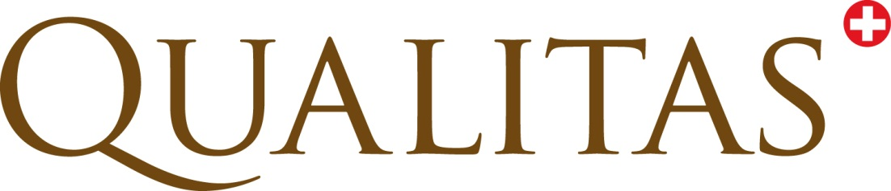

---
output:
  pdf_document:
    includes:
      in_header: tex/ATDA-ProjectPlanHeader.tex
    fig_caption: false  
  word_document: default
---

```{r GenerateDiagrams,echo=FALSE,results='hide'}
sOdgDirWin <- 'odg\\ATDA-ProjectPlan'
sOdgDir <- "odg/ATDA-ProjectPlan"
sFigDirOut <- "."
sConvCmdStem <- ifelse(.Platform$OS.type == "windows", 
                       '"C:/Program Files (x86)/LibreOffice 5/program/soffice" --headless --convert-to pdf',
                       "soffice --headless --convert-to pdf")

convertOdgToPdf <- function(psOdgFile){
  sFigFile <- ifelse(.Platform$OS.type == "windows",
                     paste(sOdgDirWin, psOdgFile, sep = "\\"),
                     file.path(sOdgDir, psOdgFile))
  sConvCommand <- paste(sConvCmdStem, sFigFile)
  system(command = sConvCommand)
  sPdfFile <- gsub("odg$", "pdf", psOdgFile)
  sFigOutFile <- file.path(sFigDirOut, sPdfFile)
  file.rename(from = sPdfFile, sFigOutFile)
}

# LibreOffice draw files
vOdgFiles <- list.files(path = sOdgDir, pattern = ".odg$")
sapply(vOdgFiles, convertOdgToPdf)
# LibreOffice calc files
vOdsFiles <- list.files(path = sOdgDir, pattern = ".ods$")
sapply(vOdsFiles, convertOdgToPdf)
```

```{r SectionNumber, echo=FALSE,results='hide'}
#' reference Class for section counting
sectionCount <- setRefClass(Class   = "SectionCount",
                            fields  = list(nSectionCount       = "numeric",
                                           nSubSectionCount    = "numeric", 
                                           nSubSubsectionCount = "numeric",
                                           sHash               = "character",
                                           sCountSep           = "character"),
                            methods = list(
                              init = function(){
                                nSectionCount       <<- 0
                                nSubSectionCount    <<- 0
                                nSubSubsectionCount <<- 0
                                sCountSep           <<- "."
                              },
                              setHash = function(psHash){
                                sHash <<- psHash
                              },
                              incrSectionCounts = function(){
                                nNrHash <- nchar(sHash)
                                if (nNrHash == 3){
                                  nSubSubsectionCount <<- nSubSubsectionCount + 1
                                } else if(nNrHash == 2){
                                  nSubSectionCount <<- nSubSectionCount + 1
                                  nSubSubsectionCount <<- 0
                                } else if(nNrHash == 1){
                                  nSectionCount <<- nSectionCount + 1
                                  nSubSubsectionCount <<- 0
                                  nSubSectionCount <<- 0
                                }
                              },
                              sGetSectionNumber = function(){
                                sSectionNumberResult <- NULL
                                if (nSectionCount > 0) 
                                  sSectionNumberResult <- as.character(nSectionCount)
                                if (nSubSectionCount > 0)
                                  sSectionNumberResult <- paste(sSectionNumberResult,
                                                                as.character(nSubSectionCount),
                                                                sep = sCountSep)
                                if (nSubSubsectionCount > 0)
                                  sSectionNumberResult <- paste(sSectionNumberResult,
                                                                as.character(nSubSubsectionCount),
                                                                sep = sCountSep)
                                return(sSectionNumberResult)
                              }
                            ))


#' Reference class for automatically enumerating section titles
SectionEnumerator <- setRefClass(Class   = "SectionEnumerator",
                                 fields  = list(sUnNumSection     = "character",
                                                rcSectionCount    = "SectionCount",
                                                sHash             = "character",
                                                sRemCaption       = "character",
                                                sNumCaptionResult = "character",
                                                sSectionSplit     = "character",
                                                nNrHash           = "numeric"
                                                ),
                                 methods = list(
                                   initSectionEnumerator = function(){
                                     sUnNumSection     <<- ""
                                     sHash             <<- ""
                                     sRemCaption       <<- ""
                                     sNumCaptionResult <<- ""
                                     sSectionSplit     <<- " "
                                     rcSectionCount$init()
                                   },
                                   setUnNumSection = function(psUnNumSection){
                                     sUnNumSection <<- psUnNumSection
                                   },
                                   parseUnNumSection = function(){
                                     vecUnNumCaption <- unlist(strsplit(sUnNumSection,sSectionSplit))
                                     sHash <<- vecUnNumCaption[1]
                                     nNrHash <<- nchar(sHash)
                                     sRemCaption <<- paste0(vecUnNumCaption[2:length(vecUnNumCaption)], 
                                                            collapse = " ")
                                     rcSectionCount$setHash(psHash = sHash)
                                     rcSectionCount$incrSectionCounts()
                                     sNumCaptionResult <<- paste(sHash,
                                                                 rcSectionCount$sGetSectionNumber(),
                                                                 sRemCaption)
                                                                 
                                   },
                                   displayNumSection = function(){
                                     cat(sNumCaptionResult, "\n")  
                                   }
                                 ))
# construct SectionEnumerator obj
objSecEnum <- SectionEnumerator$new()
objSecEnum$initSectionEnumerator()
```



\fcolorbox{black}{white}{
	\parbox[t]{1.0\linewidth}{
		\centering \fontsize{12pt}{20pt}\selectfont % The first argument for fontsize is the font size of the text and the second is the line spacing - you may need to play with these for your particular title
		\vspace*{0.5cm} % Space between the start of the title and the top of the grey box

		\hfill Projektplan - Entwurf    % put this text right adjusted

		\vspace*{0.5cm} % Space between the end of the title and the bottom of the grey box
	}
}

\vspace*{0.5cm}

\fcolorbox{black}{white}{
	\parbox[t]{1.0\linewidth}{
		\centering \fontsize{25pt}{40pt}\selectfont %
		\vspace*{0.7cm}
    ATDA-ASR                           \\
    Automatisierter Tierdatenaustausch \\
    zwischen Melksystemen und ARGUS    \\

		\vspace*{0.7cm} % Space between the end of the title and the bottom of the grey box
	}
}

\vspace*{1cm}

\begin{center}
\includegraphics[width=0.5\textwidth]{png/Pedigree.png}
\end{center}

\vspace{5ex}
{\centering \small
\hfill
\begin{tabular}{ll}
Peter von Rohr                      &  Sarah Görlich  \\
FB EDV, Qualitas AG                 &  AG ZDL, ASR  \\
\verb+http://www.qualitasag.ch+     &  \verb+http://www.asr-ch.ch+  \\
\verb+peter.vonrohr@qualitasag.ch+  &  \verb+sarah.goerlich@qualitasag.ch+
\end{tabular}
}

\pagebreak

\tableofcontents


# Dokumentenstatus

+-------------+------------------+-------+-----------------------------------------------+
|  Version    |  Datum           |  Wer  |  Änderung                                     |
+=============+==================+=======+===============================================+
|  0.0.0.900  |  11.01.2016      |  PvR  |  Erstellung                                   |
+-------------+------------------+-------+-----------------------------------------------+
|  0.0.0.901  |  13.01.2016      |  PvR  |  Aktuelle Situation und Projektziele          |
+-------------+------------------+-------+-----------------------------------------------+
|  0.0.0.902  |  18.01.2016      |  PvR  |  Projektziele und Ablauf des Datentransfers   |
+-------------+------------------+-------+-----------------------------------------------+
|  0.0.0.903  |  19.01.2016      |  PvR  |  Projektauftraggeber von BvchShb zu ASR       |
|             |                  |       |  gewechselt. Beschreibung der                 |
|             |                  |       |  Projektkomponenten und des Projektablaufs    |
+-------------+------------------+-------+-----------------------------------------------+
|  0.0.0.904  |  20.01.2016      |  PvR  |  Varianten der Datenübertragung               |
|             |                  |       |  Plan des Projektablaufs                      |
+-------------+------------------+-------+-----------------------------------------------+
|  0.0.0.905  |  21.01.2016      |  PvR  |  Ergänzung des Abschnitts Erklärung           |
|             |                  |       |  Plan des Projektablaufs                      |
+-------------+------------------+-------+-----------------------------------------------+
|  0.0.0.906  |  25.01.2016      |  PvR  |  Ergänzung des Projektablaufplans             |
+-------------+------------------+-------+-----------------------------------------------+
|  0.0.0.907  |  27.01.2016      |  PvR  |  Feedback nach AG ZT DL Sitzung.              |
|             |                  |       |  Dokumenttyp "Spezifikation" zu "Projektplan" |
|             |                  |       |  geändert. Abschnitt zu Cloud-Lösung          |
|             |                  |       |  hinzugefügt.                                 | 
+-------------+------------------+-------+-----------------------------------------------+
|  0.0.0.908  |  01.02.2016      |  PvR  |  Cloud-Anbieter Microsoft und Apple           |
|             |                  |       |  hinzugefügt.                                 | 
+-------------+------------------+-------+-----------------------------------------------+
|  0.0.0.909  |  02.02.2016      |  PvR  |  Berücksichtigung Projektplan_ATDA_20151209   |
|             |                  |       |  im Projektplan                               |
+-------------+------------------+-------+-----------------------------------------------+
|  0.0.0.910  |  03.02.2016      |  PvR  |  Ergänzung der Begründung der Projektziele.   |
|             |                  |       |  Abkürzungstabelle ergänzt                    |
+-------------+------------------+-------+-----------------------------------------------+
|  0.0.0.911  |  03.02.2016      |  SG   |  Korrekturen und Ergänzungen                  |
+-------------+------------------+-------+-----------------------------------------------+
|  0.0.0.912  |  04.02.2016      |  PvR  |  Formatierung des Projektplans, Präzisierung  |
|             |                  |       |  der Datenübertragung per Webservice          |
+-------------+------------------+-------+-----------------------------------------------+
|  0.0.0.913  |  08.02.2016      |  SG   |  Schaubilder für drei Arten der               |
|             |                  |       |  Datenübertragung                             |
+-------------+------------------+-------+-----------------------------------------------+
|  0.0.0.914  |  10.02.2016      |  PvR  |  Titel von Schaubilder entfernt               |
+-------------+------------------+-------+-----------------------------------------------+
|  0.0.1.000  |  13.04.2016      |  PvR  |  Anpassungen nach Meeting mit Melkmaschinen   |
|             |                  |       |  Hersteller                                   |
+-------------+------------------+-------+-----------------------------------------------+
|  0.0.1.100  |  24.05.2016      |  PvR  |  Anpassungen nach Gespräch mit Bert v. Land   |
+-------------+------------------+-------+-----------------------------------------------+
|  0.0.1.101  |  25.05.2016      |  PvR  |  Schaubild für DE Projekt von CRV NL          |
+-------------+------------------+-------+-----------------------------------------------+
|  0.0.1.102  |  25.05.2016      |  PvR  |  Anpassungen des Projektplans                 |
+-------------+------------------+-------+-----------------------------------------------+
|  0.0.1.103  |  06.06.2016      |  PvR  |  Korrekturen von Formulierungen               |
+-------------+------------------+-------+-----------------------------------------------+


\pagebreak

# Abkürzungen

+-------------+-------------------------------------------------------------------------+
|  Abkürzung  |  Bedeutung                                                              |
+=============+=========================================================================+
| AG ZT DL    |  Arbeitsgruppe zuchttechnische Dienstleistungen                         |
+-------------+-------------------------------------------------------------------------+
| ASR         |  Arbeitsgemeinschaft Schweizerischer Rinderzüchter                      |
+-------------+-------------------------------------------------------------------------+
| FB EDV      |  Fachbereich elektronische Datenverarbeitung                            |
+-------------+-------------------------------------------------------------------------+
| ATDA        |  Automatisierter Tierdatenaustausch                                     |
+-------------+-------------------------------------------------------------------------+
| ATDA-ASR    |  Projekt von ASR zur Automatisierung des Tierdatenaustauschs            |
|             |  (das in diesem Dokument beschriebene Projekt)                          |
+-------------+-------------------------------------------------------------------------+
| SSATDA-ASR  |  Software-System, welches im Projekt ATDA-ASR entwickelt wird           |
+-------------+-------------------------------------------------------------------------+
| BVCH        |  Braunvieh Schweiz                                                      |
+-------------+-------------------------------------------------------------------------+
| SHB         |  Swissherdbook                                                          |
+-------------+-------------------------------------------------------------------------+
| ICAR        |  International Committee for Animal Recording                           |
+-------------+-------------------------------------------------------------------------+
| ADE         |  "Animal Data Exchange", Austausch von Tierdaten                        |
+-------------+-------------------------------------------------------------------------+
| ICAR-ADE    |  Projekt für den Austausch von Tierdaten von ICAR                       |
+-------------+-------------------------------------------------------------------------+
| ARGUS       |  Informationssystem für brunaNet, redonline+, etc                       |
+-------------+-------------------------------------------------------------------------+
| ISM         |  Informationssystem der Melkanlage                                      |
+-------------+-------------------------------------------------------------------------+
| W3C         |  World Wide Web Consortium                                              |
+-------------+-------------------------------------------------------------------------+
| UNCEFACT    |  United Nations Center for Trade Fascilitation and Electronic Business  |
+-------------+-------------------------------------------------------------------------+
| ISO         |  International Organization for Standardization                         |
+-------------+-------------------------------------------------------------------------+
| ZO          |  Zuchtorganisation                                                      |
+-------------+-------------------------------------------------------------------------+
| SSAD        |  Software-System für den automatisierten Datenaustausch                 |
+-------------+-------------------------------------------------------------------------+
| API         |  Application Programming Interface                                      |
+-------------+-------------------------------------------------------------------------+
| MLP         |  Milchleistungsprüfung                                                  |
+-------------+-------------------------------------------------------------------------+
| AMS         |  Automatische Melksysteme                                               |
+-------------+-------------------------------------------------------------------------+
| BBB         |  Blinden- und Behindertenzentrum Bern                                   |
+-------------+-------------------------------------------------------------------------+
| TVD         |  Tierverkehrsdatenbank                                                  |
+-------------+-------------------------------------------------------------------------+
| CRV         |  Cooperative Cattle Improvement                                         |
+-------------+-------------------------------------------------------------------------+
| NDX         |  Nordic Data Exchange                                                   |
+-------------+-------------------------------------------------------------------------+
| BvL         |  Bert van't Land                                                        |
+-------------+-------------------------------------------------------------------------+

\pagebreak


# Erklärung
Dieses Dokument enthält einen Planungsentwurf für das Projekt zum automatisierten Tierdatenaustausch (ATDA), welches von der Arbeitsgruppe zuchttechnische Dienstleistungen der Arbeitsgemeinschaft Schweizerischer Rinderzüchter (ASR) in Auftrag gegeben wurde.

Die Umsetzung dieses Projektes hängt sehr stark von den technischen Gegebenheiten der Anbieter von Melkanlagen ab. Deshalb ist der Projektplan in gewissen Abschnitten noch nicht sehr konkret gefasst. Dies ist eine bewusste Entscheidung, welche die Offenheit und die Flexibilität unsererseits demonstrieren soll. Das erste Informationstreffen mit den Anbietern von Melkanlagen fand am 18. März 2016 statt. Diese Treffen hat uns erste Informationen zum möglichen Rahmen dieses Projekts aus Sicht der Melkanlagenanbieter geliefert. 


\vspace{1ex}
```{r echo=FALSE,results='asis'}
objSecEnum$setUnNumSection(psUnNumSection = 
"# Ausgangslage")
objSecEnum$parseUnNumSection()
objSecEnum$displayNumSection()
```
```{r echo=FALSE,results='asis'}
objSecEnum$setUnNumSection(psUnNumSection = 
"## Aktuelle Situation betreffend Datenaustausch")
objSecEnum$parseUnNumSection()
objSecEnum$displayNumSection()
```
Die Standardprozedur für den Transfer von Milchleistungsdaten von Betrieben, welche sich bei der Milchleistungsprüfung (MLP) der Zuchtverbände (BVCH und SHB) beteiligen, sieht so aus, dass ein Milchkontrolleur alle 31 bis 37 Tage Milchproben zieht und Milchwägungen vornimmt. Die Milchmengen werden während der Kontrolle auf dem Betrieb manuell auf vorgedruckte Formulare (Begleitscheine) eingetragen. Die ausgefüllten Formulare werden dann an die Zuchtorganisationen geschickt und dort per Scanner in das Informationssystem (ARGUS) von Qualitas eingelesen. Das nachfolgende Schaubild stellt den Datenfluss anlässlich einer Milchkontrolle auf einem Betrieb schematisch dar. Der Datenfluss verläuft gemäss der Reihenfolge der Nummern. Die Bedeutung der einzelnen Nummern wird später noch erklärt werden.


Betriebe mit Robotermelkanlagen (AMS) oder mit Melkständen, bei welchen die Milchmengen durch ein Informationssystem vollautomatisch erfasst werden, unterliegen bezüglich des Datentransfers der gleichen  Standardprozedur, mit Ausnahme, dass die Milchmengen nicht von den Kontrolleuren gemessen werden, sondern aus dem Informationssystem der Melkanlage abgerufen werden. Die Milchmengendaten werden vom Kontrolleur manuell vom Informationssystem der Melkanlage auf das Formular übertragen. Dieses Formular wird bei der Zuchtorganisation eingescannt. Die manuelle Übertragung der Daten auf das Formular ist 

- zeitaufwändig, 
- fehleranfällig, 
- vom technischen Standpunkt her gesehen unnötig und 
- verursacht einen substantiellen administrativen Mehraufwand. 

Ein __Ziel dieses Projektes__ ist, die manuelle Datenübertragung durch eine direkte elektronische Übertragung der Milchmengendaten zwischen dem Informationssystem der Melkanlage und dem Informationssystem von Qualitas (ARGUS) zu ersetzen. 


```{r echo=FALSE,results='asis'}
objSecEnum$setUnNumSection(psUnNumSection = 
"## Terminologie und Gültigkeitsbereich")
objSecEnum$parseUnNumSection()
objSecEnum$displayNumSection()
```
```{r echo=FALSE,results='asis'}
objSecEnum$setUnNumSection(psUnNumSection = 
"### Melkanlage")
objSecEnum$parseUnNumSection()
objSecEnum$displayNumSection()
```
Als zwingende Voraussetzung damit ein Betrieb in diesem Projekt berücksichtigt werden kann, ist eine Melkanlage, welche mindestens die Menge jedes Gemelks misst und diese Messung in einem Informationssystem dauerhaft abspeichert. Diese Voraussetzung dürfte von Robotermelkanlagen (AMS) und von gewissen Melkständen erfüllt sein. Als Konvention werden von nun an Robotermelkanlagen und Melkstände, welche die Voraussetzung der Erfassung und Speicherung der Milchmengendaten erfüllen,  als __Melkanlagen__ bezeichnet. 

```{r echo=FALSE,results='asis'}
objSecEnum$setUnNumSection(psUnNumSection = 
"### Informationssystem der Melkanlage (ISM)")
objSecEnum$parseUnNumSection()
objSecEnum$displayNumSection()
```
Die erfassten Milchmengendaten werden in einem Informationssystem gespeichert. Ein solches Informationssystem kann als zentrale Komponente eine Datenbank oder eine spezialisierte Struktur von verschiedenen Dateien enthalten. Die Datenbank oder die Dateistruktur wird durch Softwareprogramme ergänzt, welche das Datenmanagement und den Unterhalt für die Benutzer erleichtern. Das Informationssystem zur Speicherung der Milchmengendaten wird von nun an als __Informationssystem der Melkanlage__ (ISM) bezeichnet.  

```{r echo=FALSE,results='asis'}
objSecEnum$setUnNumSection(psUnNumSection = 
"### Automatisierter Tierdatenaustausch (ATDA)")
objSecEnum$parseUnNumSection()
objSecEnum$displayNumSection()
```
Das in diesem Dokument beschriebene Projekt befasst sich mit dem automatisierten Tierdatenaustausch zwischen Informationssystemen einer Melkanlage (ISM) und dem Informationssystem von Qualitas (ARGUS). Dieses Projekt wurde von der ASR initiiert und wird in Zusammenarbeit mit Qualitas umgesetzt. Von nun an wird das in diesem Dokument beschriebene  Projekt mit __ATDA-ASR__ bezeichnet.

```{r echo=FALSE,results='asis'}
objSecEnum$setUnNumSection(psUnNumSection = 
"### Software-System für den automatisierten Tierdatenaustausch (SSATDA-ASR)")
objSecEnum$parseUnNumSection()
objSecEnum$displayNumSection()
```
Das Endprodukt des Projektes (`ATDA-ASR`) ist ein Software-System bestehend aus verschiedenen Programmen. Diese Programme entsprechen der umgesetzten Lösung des Projektes `ATDA-ASR`. Von nun an wird dieses Software-System mit __SSATDA-ASR__ bezeichnet.


```{r echo=FALSE,results='asis'}
objSecEnum$setUnNumSection(psUnNumSection = 
"## Andere Datenaustauschprojekte")
objSecEnum$parseUnNumSection()
objSecEnum$displayNumSection()
objSecEnum$setUnNumSection(psUnNumSection = 
"### ICAR-ADE")
objSecEnum$parseUnNumSection()
objSecEnum$displayNumSection()
```
Bei ICAR läuft das Projekt "ICAR-ADE" mit dem Ziel eine Grundlage für den automatisierten Austausch von Tierdaten zu erstellen. Im Projekt "ICAR-ADE" wird eine eigenständige Lösung für den automatischen Austausch von Tierdaten angestrebt. Das heisst, es werden neue Datentypen und Schnittstellen aufgrund von existierenden Standards von W3C, UNCEFACT oder ISO definiert. Diese Definitionen dienen dann als Grundlage für eine unabhängige Umsetzung des Datenaustauschs. Der Vorteil dieser Lösung ist die Unabhängigkeit von bestehenden Lösungen und all ihren Einschränkungen. Ein offensichtlicher Nachteil ist die Redundanz mit anderen schon bestehenden Datenaustauschlösungen. Dieser Nachteil führt dazu, dass eine  Umsetzung des Projekts sehr zeitaufwändig ist. Da das Projekt "ICAR-ADE" immer noch in der technischen Planungsphase steckt, wird die Umsetzung einer konkreten Lösung noch eine Weile auf sich warten lassen.

Das Projekt "ICAR-ADE" steckt noch in der Anfangsphase. Da der automatisierte Datenaustausch über das Projekt "ICAR-ADE" mittelfristig noch nicht zur Verfügung steht, hat sich die ASR dazu entschieden, ein eigenes Projekt auf nationaler Ebene, mit dem Ziel des automatisierten Tierdatenaustauschs (`ATDA-ASR`) zu realisieren. Ab Abschnitt 2 des vorliegenden Textes wird das Projekt `ATDA-ASR` genauer beschrieben werden.


```{r echo=FALSE,results='asis'}
objSecEnum$setUnNumSection(psUnNumSection = 
"### CRV Holland")
objSecEnum$parseUnNumSection()
objSecEnum$displayNumSection()
```
Gemäss Informationen (Telefonkonferenz vom 19.05.2016) von Bert van't Land (CRV Holland) betreibt CRV ein nationales Datenaustauschprojekt mit allen Roboterbetrieben in Holland. In diesem Projekt sind rund 3000 Betriebe beteiligt. Diese Betriebe weisen eine durchschnittliche Bestandesgrösse von 100 Kühen auf und jede Kuh sucht die Melkanlage pro Tag im Mittel 2.5 mal auf. Somit werden in diesem Projekt rund 1 Mio Records pro Tag von allen Betrieben auf die Datenbank bei CSM übermittelt (siehe nachfolgendes Schaubild). Jeder Record enthält das Datum und die Zeit des Melkvorganges, die Milchmenge und eine Identifikation (ID) der Kuh. Die reine Menge an übermittelten Daten ohne Metadaten beträgt rund 30 MB pro Tag. Mit Metadaten wird die total Datenmenge sehr wahrscheinlich immer noch kleiner sein, als 100 MB pro Tag.

Die technische Umsetzung des Datenaustauschs in Holland wurde von CRV an ein Informatikunternehmen names CSM ausgelagert. Dieses Unternehmen betreibt die Datenbank (siehe Schaubild) und hat auch PlugIns für die ISM der verschiedenen Melkanlagenanbietern geschrieben. Diese PlugIns werden auf den Betrieben installiert und übermitteln die Daten auf die zentrale Datenbank. CRV Holland hat Zugriff auf die Milchmengendaten in der zentralen Datenbank bei CSM.


```{r echo=FALSE,results='asis'}
objSecEnum$setUnNumSection(psUnNumSection = 
"### NDX Skandinavien")
objSecEnum$parseUnNumSection()
objSecEnum$displayNumSection()
```
`NDX` steht für Nordic Data Exchange. Dies soll ein Projekt sein, welches den Datenaustausch in den skandinavischen Ländern automatisiert. Von Seiten der Hersteller sind Lely und DeLaval beteiligt. 


\vspace{1ex}
```{r echo=FALSE,results='asis'}
objSecEnum$setUnNumSection(psUnNumSection = 
"# Ziele")
objSecEnum$parseUnNumSection()
objSecEnum$displayNumSection()
```
```{r echo=FALSE,results='asis'}
objSecEnum$setUnNumSection(psUnNumSection = 
"## Primäre Zielsetzung")
objSecEnum$parseUnNumSection()
objSecEnum$displayNumSection()
```
Das primäre Ziel dieses Projekts ist es, die manuelle Übertragung von Milchmengendaten durch Milchkontrolleure auf Betrieben mit entsprechenden Melkanlagen zu ersetzen mit einer direkten elektronischen Übertragung der Milchmengendaten vom Informationssystem der Melkanlage zum Informationssystem von Qualitas (ARGUS). 

```{r echo=FALSE,results='asis'}
objSecEnum$setUnNumSection(psUnNumSection = 
"## Funktionale Zielsetzung")
objSecEnum$parseUnNumSection()
objSecEnum$displayNumSection()
```
Der Datentransfer zwischen Melksystem und ARGUS muss im Normalbetrieb ohne manuelle Intervention einer Person funktionieren. Manuelle Interventionen einer Person sollen nur im Fall eines Fehlers erforderlich sein. 


```{r echo=FALSE,results='asis'}
objSecEnum$setUnNumSection(psUnNumSection = 
"## Erweiterte Zielsetzungen")
objSecEnum$parseUnNumSection()
objSecEnum$displayNumSection()
```
Vom technischen Standpunkt her gesehen, kann der automatisierte Datentransfer zwischen den Informationssystemen der Melkanlagen und ARGUS in beiden Richtungen, also nicht nur vom ISM zu ARGUS sondern auch von ARGUS zum ISM funktionieren. Damit ergeben sich zahlreiche Anwendungen, zum Beispiel können bei einer Neuinstallation einer Melkanlage die Daten von ARGUS ins Informationssystem der Melkanlage übertragen werden.


\vspace{1ex}
```{r echo=FALSE,results='asis'}
objSecEnum$setUnNumSection(psUnNumSection = 
"# Automatisierter Tierdatenaustausch (ATDA)")
objSecEnum$parseUnNumSection()
objSecEnum$displayNumSection()
```
\vspace{1ex}
```{r echo=FALSE,results='asis'}
objSecEnum$setUnNumSection(psUnNumSection = 
"## Komponenten des ATDA")
objSecEnum$parseUnNumSection()
objSecEnum$displayNumSection()
```
Der ATDA Prozess, welcher aus diesem Projekt `ATDA-ASR` resultieren soll, kann in drei Komponenten aufgeteilt werden.

1. __Export__ der Milchmengendaten aus dem ISM
2. __Transfer__ der exportierten Milchmengendaten vom ISM zu ARGUS
3. __Import__ der transferierten Daten in ARGUS

\vspace{1ex}
```{r echo=FALSE,results='asis'}
objSecEnum$setUnNumSection(psUnNumSection = 
"### Export der Milchmengendaten")
objSecEnum$parseUnNumSection()
objSecEnum$displayNumSection()
```
Die für dieses Projekt (`ATDA-ASR`) interessanten Milchmengendaten sind im ISM abgelegt. Damit diese Daten zum Informationssystem der ZO bei Qualitas übertragen werden können, müssen sie zuerst aus dem ISM exportiert werden. Das Resultat dieses Datenexports muss je nach verwendeter Übertragungsmethode (siehe Abschnitte 3.1.2 und 4) anders aussehen. Die speziellen Anforderungen der exportierten Daten je nach Übertragungsmethode werden in Abschnitt 4 noch genauer beschrieben. Gemäss den Vorstellungen der Melkanlagenanbieter bezüglich des Ablaufs des Datenaustauschs (mehr dazu in Abschnitt 4) liegt dieser Teil des Projekts `ATDA-ASR` voll in der Verantwortung der Melkanlagenanbieter.

\vspace{1ex}
```{r echo=FALSE,results='asis'}
objSecEnum$setUnNumSection(psUnNumSection = 
"### Transfer der exportierten Milchmengendaten vom ISM zu ARGUS")
objSecEnum$parseUnNumSection()
objSecEnum$displayNumSection()
```
Der Datentransfer beinhaltet die Übertragung der exportierten Daten vom ISM zu ARGUS. Für die Übertragung von Daten zwischen zwei Informationssystemen gibt es schon existierenden Lösungen. Zum aktuellen Zeitpunkt sind für dieses Projekt `ATDA-ASR` grundsätzlich drei verschiedene Arten der Datenübertragung denkbar. Diese werden in einem späteren Abschnitt (siehe Abschnitt 4) noch genauer beschrieben.

\vspace{1ex}
```{r echo=FALSE,results='asis'}
objSecEnum$setUnNumSection(psUnNumSection = 
"### Import der transferierten Daten in ARGUS")
objSecEnum$parseUnNumSection()
objSecEnum$displayNumSection()
```
Der Import der transferierten Daten in ARGUS ist eine Aufgabe, welche aufgrund der Formatdefinition der transferierten Daten in ARGUS auf der Datenbank realisiert werden kann. Die aktuelle Version von ARGUS hat schon existierende Funktionalitäten, welche für den Import von anderen Daten verwendet werden. Beispiele dafür sind der Import von Daten ab der TVD von Identitas oder die automatisierte Übertragung von Besamungsdaten zwischen KB-Organisationen und Qualitas.

\vspace{1ex}
```{r echo=FALSE,results='asis'}
objSecEnum$setUnNumSection(psUnNumSection = 
"## Geplanter Ablauf des ATDA")
objSecEnum$parseUnNumSection()
objSecEnum$displayNumSection()
```
Das folgende Schema gibt einen Überblick über den geplanten Ablauf des ATDA. Der Datenfluss läuft gemäss der Reihenfolge der Nummern im Schema ab. Vor der Milchkontrolle erhält der Kontrolleur das Material für die Kontrolle (Schritt 1). Im Schritt 2 führt der Kontrolleur die Milchkontrolle zu einem bestimmten Datum (entspricht dem Stichdatum für die Datenübertragung der Milchmengendaten) auf einem Betrieb durch. Bei der Milchkontrolle werden durch den Milchkontrolleur keine Milchmengendaten mehr erhoben. Stattdessen werden auf den vorgedruckten Formularen für den kontrollierten Betrieb die Mutationen (Zugänge und Abgänge) von Kühen sowie die Änderungen der Laktationsstati (trocken gestellt oder gekalbt) von Kühen erfasst. Das ausgefüllte Formular wird der ZO zugestellt, wo sie zur Überprüfung der Datenkonsistenz mit den übertragenen Milchmengendaten verarbeitet werden. Die Milchproben werden an das Milchlabor gesendet (Schritt 3). Im Schritt 4 liefert das Milchlabor die Analyseergebnisse an Qualitas von wo sie dann dem Betrieb zurückgemeldet werden (Schritt 5), entweder schriftlich per Post, oder via online Zugang zum Informationssystem der ZO (ARGUS).


Das Eintreffen der Milchanalyseergebnisse bei Qualitas für den kontrollierten Betrieb ist der Auslöser für den ATDA zwischen ARGUS und dem ISM des kontrollierten Betriebs (Schritt 6). Das Datum der Milchkontrolle wird als Stichdatum für den ATDA verwendet. 


\vspace{1ex}
```{r echo=FALSE,results='asis'}
objSecEnum$setUnNumSection(psUnNumSection = 
"# Arten des Datentransfers in ATDA-ASR")
objSecEnum$parseUnNumSection()
objSecEnum$displayNumSection()
```
Für dieses Projekt `ATDA-ASR` sind vorerst drei Arten des Datentransfers vorstellbar. Nach dem Treffen mit den Herstellern der Melkanlagen ist klar, dass für die Melkanlagenanbieter nur eine Cloud-basierte Datenübertragung (Variante 3) in Frage kommt. Die Details zur Umsetzung einer solchen Datenübertragung sind noch unklar. Da  CRV-Holland zusammen mit den Anbietern Lelly, DeLaval und Fullwood schon ein Service zum automatischen Tierdatenaustausch betreibt, haben wir mit Bert van't Land von CRV Kontakt aufgenommen. Die Informationen zu diesem Projekt sind in den Abschnitten 1.3.2 und 5beschrieben. 

Der Vollständigkeit halber und zu Dokumentationszwecken werden hier trotzdem noch alle drei Varianten des Datenaustauschs beschrieben im Wissen, dass die ersten beiden Varianten höchstwahrscheinlich nicht umgesetzt werden können.

1. Eigenständiger Webservice
2. Fernwartungssoftware
3. Cloud-basierte Datenübertragung

\vspace{1ex}
```{r echo=FALSE,results='asis'}
objSecEnum$setUnNumSection(psUnNumSection = 
"## Eigenständiger Webservice")
objSecEnum$parseUnNumSection()
objSecEnum$displayNumSection()
```
Diese Version entspricht im Wesentlichen der Umsetzung der im Projekt `ICAR-ADE` definierten Datentypen und Schnittstellen in einem eigenständigen Webservice. Dieser Webservice wird von Qualitas zur Verfügung gestellt und läuft auf einem Server von Qualitas. Die Datenübertragung wird von einem Client-Programm auf dem ISM gestartet. Dieses Programm kontaktiert den Webservice, welcher als Antwort die Definition der zu übertragenden Datenrecords zurückgibt. Aufgrund der Definition der Datenrecords werden die entsprechenden Daten als sogenannter Datenstrom mit einem definierten Format an Qualitas gesendet. Da die Datenübertragung vom Client-Programm des ISM initiiert wird, muss auf dem ISM das entsprechende Client-Programm, welches den Datenaustausch mit dem Webservice bei Qualitas initiiert, installiert sein. Das folgende Schaubild stellt den Datenaustausch per Webservice schematisch dar.


Gemäss den Rückmeldungen der Melkanlagenanbieter ist eine Installation eines Client-Programms auf den ISM nicht praktikabel. Diese Systeme sind nicht homogen, z. Bsp. betreffend der verwendeten Version des Betriebssystems oder betreffend installierten Softwareprogrammen. Diese Einschätzung wird auch durch die ersten Resultat der Befragung der Melkanlagenanbieter bestätigt. Des Weiteren sind die ISM-System nicht immer stabil und teilweise schlecht gewartet. 


\vspace{1ex}
```{r echo=FALSE,results='asis'}
objSecEnum$setUnNumSection(psUnNumSection = 
"## Fernwartungssoftware")
objSecEnum$parseUnNumSection()
objSecEnum$displayNumSection()
```
Aufgrund unserer ersten bilateralen Abklärungen mit den Anbietern von Robotermelkanlagen, verfügen die Techniker der Anbieterfirmen der Melkanlagen über einen Zugang von einem Remote-Standort auf das ISM. Dieser Zugang von extern auf das ISM wird mittels sogenannter Fernwartungssoftware ermöglicht. In der Regel erlauben diese Fernwartungsprogramme auch den Austausch von Dateien zwischen den beiden Systemen, welche miteinander in Verbindung stehen. 

Damit der Datentransfer mithilfe einer Ferwartungssoftware ohne manuelle Intervention umgesetzt werden kann, muss die Steuerung der Fernwartungssoftware von einem Programm aus möglich sein. Dies wird über ein von den Anbietern der Fernwartungssoftware zur Verfügung gestellte Schnittstelle - dem sogenannten API - realisiert. Das API besteht aus einer Spezifikation der Funktionalitäten der Fernwartungssoftware, welche von einem externen Programm verwendet werden können. 
Die Umsetzung dieser Lösung für den Datentransfer wäre sehr viel einfacher, wenn alle Hersteller die gleiche Fernwartungssoftware verwenden würden. Eine Abklärung diesbezüglich hat allerdings ergeben, dass verschiedene Fernwartungssoftwareprodukte zum Einsatz kommen. 

\pagebreak

Die folgende Tabelle gibt eine Übersicht über die verwendeten Fernwartungsprogramme

+-----------+-----------------------------------+--------------------------------------+
| Anbieter  |  Verwendete Fernwartungssoftware  |  Bemerkung                           |
+===========+===================================+======================================+
| DeLaval   |  Teamviewer                       |  für existierende Installationen     |
+-----------+-----------------------------------+--------------------------------------+
|           |  LogMeIn                          |  für Neuinstallationen               |
+-----------+-----------------------------------+--------------------------------------+
| Lelly     |  TeamViewer                       |  Versionen 6 und 11                  |
+-----------+-----------------------------------+--------------------------------------+
| GEA       |  FarmView                         |  Verschlüsselungsrouter beim Kunden  |
+-----------+-----------------------------------+--------------------------------------+
|           |  AnyDesk                          |  Testeinsatz                         |
+-----------+-----------------------------------+--------------------------------------+
| Fullwood  |  TeamViewer                       |                                      |
+-----------+-----------------------------------+--------------------------------------+


Die Anzahl an verschiedenen Fernwartungsprogrammen erschwert uns die Verwendung dieser Programme für den Datenaustausch. Zusätzlich zur Anzahl der eingesetzten Fernwartungslösungen kommt noch hinzu, dass allfällige Wechsel der eingesetzten Programme oder Updates von bestehenden Programmen für uns zu einem grossen Arbeitsaufwand führen und potentielle Fehlerquellen dadurch nur schwer zu kontrollieren sind.

Die einzige Möglichkeit, wie diese Art des Datentransfers für uns noch praktikabel wäre, ist, dass uns die Anbieter erlauben würden, eine einheitliche Ferwartungslösung neben den bestehenden Programmen zu installieren. Das folgende Schaubild gibt einen Überblick über die Datenaustausch per Fernwartungssoftware. 

\begin{center}
\includegraphics[width=0.9\textwidth]{Schaubild_ATDA_Fernwartung}
\end{center}

Die oben beschriebene negative Einschätzung dieser Variante wurde durch die Rückmeldungen der Melkanlagenanbieter bestätigt. Abgesehen von der grossen Anzahl an eingesetzten Ferwartungslösungen, können Anbieter aufgrund von Verträgen auch das eingesetzte Fernwartungssystem wechseln, was für uns zu einem nochmals grösseren Arbeitsaufwand führen würde. 


\vspace{1ex}
```{r echo=FALSE,results='asis'}
objSecEnum$setUnNumSection(psUnNumSection = 
"## Cloud-basierte Datenübertragung")
objSecEnum$parseUnNumSection()
objSecEnum$displayNumSection()
```
Im Zeitalter von "big data" wird häufig von Daten in der Wolke (oder Cloud) gesprochen. Damit ist gemeint, dass sich die Daten physikalisch nicht mehr auf einer für den Benutzer spezifischen Rechner befinden, sondern in einem bestimmten Server-Netzwerk eines Anbieters abgelegt werden. Bekannte öffentliche Anbieter für Cloud-basierte Speicherlösungen sind "Dropbox", "Google Drive", "Microsoft Azure/Onedrive" oder "Apple iCloud". Gemäss ersten Abklärungen mit den Herstellern von Melkanlagen bestehen Pläne bei den Herstellern interne Cloud-Speicherlösungen aufzubauen. 

```{r echo=FALSE,results='asis'}
objSecEnum$setUnNumSection(psUnNumSection = 
"### Datenaustausch über Cloud-Speicher der Melkanlagenhersteller")
objSecEnum$parseUnNumSection()
objSecEnum$displayNumSection()
```
Für die Verwendung einer Cloud-Speicherlösung eines Melkanlagenherstellers sind wir darauf angewiesen, dass wir einen Zugang zum Speicher erhalten und dass wir eine Schnittstelle für das Übertragen der Daten verwenden können. Laut den Aussagen der Vertreter der Melkanlagenhersteller dürften die Firmen-internen Cloud-Lösungen für dieses Projekt `ATDA-ASR` kaum zugänglich sein. 

```{r echo=FALSE,results='asis'}
objSecEnum$setUnNumSection(psUnNumSection = 
"### Datenaustausch über öffentliche Anbieter von Cloud-Speicher")
objSecEnum$parseUnNumSection()
objSecEnum$displayNumSection()
```
Bezüglich des Datenaustauschs besteht zwischen den Anbietern von Speicherlösungen kein Unterschied. In allen Fällen muss jeder in diesem Projekt (`ATDA-ASR`) beteiligte Betrieb ein Benutzerkonto beim verwendeten Anbieter des Cloud-Speichers anlegen. Danach wird ein Programm (Client) auf dem Rechner des ISM installiert und mit dem erstellten Benutzerkonto verbunden. Auf dem Rechner des ISM wird ein neues Unterverzeichnis erstellt, dessen Inhalt automatisch mit dem Speicher im Netzwerk des Anbieters  synchronisiert wird. Die auszutauschenden Daten müssen im neu erstellten Unterverzeichnis abgelegt werden. In den Einstellungen der Clientprogramme der Cloud-Speicher müssten die Daten für ein spezifischen Benutzerkonto von Qualitas freigegeben werden. Durch diese Freigabe können die Daten vom ISM zu Qualitas übertragen werden. Der Datentransfer per Cloud-Speicher ist im folgenden Schaubild dargestellt.

```{r echo=FALSE,results='asis'}
objSecEnum$setUnNumSection(psUnNumSection = 
"### Datenaustausch über einen eigenständigen Speicherservice")
objSecEnum$parseUnNumSection()
objSecEnum$displayNumSection()
```
Die Benutzung von öffentlichen Cloud-Anbietern ist aus Gründen des Datenschutzes nicht ganz einfach. Ab einer gewissen Datenmenge sind die meisten Cloud-Dienste kostenpflichtig. Deshalb wurde von den Melkanlagenherstellern vorgeschlagen selber eine zentrale Datenaustausch-Infrastruktur zu erstellen. Die Anforderungen an ein solches Speichersystem bestehen darin, dass dieses System für die im Projekt beteiligten Betriebe und für das Datenbanksystem von Qualitas AG zugänglich sein muss. Die zentrale Funktionaliät des Speichersystems besteht in einer Art Datendrehscheibe, wobei die Betriebe die Milchmengendaten an das Speichersystem senden können und relevante Tierdaten vom System beziehen können. Das Informationssystem von Qualitas AG soll die Milchmengendaten beim Speichersystem abholen können und die für die Betriebe relevante Tierdaten an das System senden  können.

\begin{center}
\includegraphics[width=0.75\textwidth]{Schaubild_ATDA_Cloud}
\end{center}


\vspace{1ex}
```{r echo=FALSE,results='asis'}
objSecEnum$setUnNumSection(psUnNumSection = 
"# Plan des Projektablaufs")
objSecEnum$parseUnNumSection()
objSecEnum$displayNumSection()
```
Die Tabelle am Ende dieses Dokuments zeigt einen ungefähren Plan, wie sich die bis zu aktuellen Zeitpunkt bekannten Themen auf die Wochen 20 bis 40 von 2016 aufteilen lassen. __Wichtig__ ist die Tatsache, dass dieser Projektplan nicht abschliessend ist und somit das Projekt in Woche 40 von 2016 nicht abgeschlossen sein wird. 

Anlässlich des Treffens mit den Melkanlagenanbietern am 18.3.2016 erfuhren wir, dass CRV Holland mit den Firmen DeLaval, Lelly und Fullwood bereits ein Service eines automatischen Tierdatenaustauschs betreibt. Zur Vermeidung von Doppelspurigkeiten und zur Minimierung des Aufwandes in diesem Projekt für die Melkanlagenanbieter und für uns, haben wir Kontakt zu Bert van 't Land (BvL) von CRV Holland aufgenommen (Telefonkonferenz am 19.05.2016, siehe dazu Abschnitt 1.3.2). Zusammenfassend werden im Datenaustauschprojekt in Holland von rund 3000 Betrieben mit Robotermelkanlagen täglich rund 1 Mio Milchmengenrecords von den Betrieben auf die zentrale Datenbank übertragen. Unter Berücksichtigung eines Datenoverheads, entspricht dies einer Datenmenge von rund 100MB pro Tag. Das Betreiben der zentralen Datenbank sowie die Programmierung von ISM-spezifischen PlugIns wurde von CRV zu CSM - einer externen Informatikfirma - ausgelagert. Die PlugIns werden auf den ISM jedes Betriebs installiert. Dort steuern sie die Übertragung der Daten von den Betrieben zur zentralen Datenbank. 

Bei der Beschreibung des Datenexports in diesem Dokument (Abschnitt 3.1.1) liegt die Verantwortung des Datenexports bei den Melkanlagenanbietern. Im Gegensatz dazu, wird im Datenübertragungs-Projekt von CRV-Holland der Datenexport und die Übertragung von einem durch CSM geschriebenes PlugIn übernommen. Das PlugIn, welches die Datenübertragung steuert, muss spezifisch für den Anbieter des ISM sein. Das heisst es braucht für jeden ISM-Anbieter ein anderes PlugIn. Diese Anforderung der spezifischen PlugIns würde sich auch für unser Projekt `ATDA-ASR` ergeben, da die in der Schweiz eingesetzten ISMs unterschiedliche Technologien verwenden. Die Tatsache, dass unterschiedliche ISM-Anbieter unterschiedliche Technologien einsetzen, wird durch die Ergebnisse unserer Befragung der Melkanlagenanbieter bestätigt. 
BvL hat sich bereit erklärt, die Ansprechsperson für Fragen betreffend des holländischen Datenaustauschprojekts zu sein. Er klärt CRV-intern ab, ob und in welchem Umfang eine Zusammenarbeit zwischen diesem Projekt `ATDA-ASR` und CRV-Holland möglich ist.

Weiterhin konzentrieren wir uns auf weitere Abklärungen mit den Melkroboteranbieter und auf mögliche Umsetzungen für ein cloud-basiertes Speichersystem.

Abgesehen von der Datenübertragung gibt es auch noch offene Fragen betreffend des Exports von Daten vom ISM, welche dann zu ARGUS übertragen werden können. Je nach Grösse der Datenmenge bestehen auch gewisse Abhängigkeiten zwischen dem Datenexport auf der Seite des ISM und der Art der Datenübertragung. Die aufgezeigten Möglichkeiten der Datenübertragung haben nicht alle die gleichen Kapazitäten betreffend der zu übertragenen Datenmengen. Ein Ziel der geplanten Testsysteme für die Datenübertragung ist die Abklärung solcher Kapazitätsfragen.

\vspace{1ex}
```{r echo=FALSE,results='asis'}
objSecEnum$setUnNumSection(psUnNumSection = 
"# Datenkonsistenz")
objSecEnum$parseUnNumSection()
objSecEnum$displayNumSection()
```
Die Erfassung der Mutationen und der Änderungen des Laktationsstatus' von Kühen auf den jeweiligen Betrieben durch den Milchkontrolleur dient als Kontrolle für das System SSATDA-ASR. Die von `SSATDA-ASR` abgeholten Daten nach einer Milchkontrolle müssen mit den vom Milchkontrolleur erfassten Mutationen und Änderungen des Laktationsstatus von Kühen konsistent sein.

\vspace{1ex}
```{r echo=FALSE,results='asis'}
objSecEnum$setUnNumSection(psUnNumSection = 
"# Abgrenzung")
objSecEnum$parseUnNumSection()
objSecEnum$displayNumSection()
```
In diesem Projekt beschränken wir uns auf den Austausch von Milchleistungsdaten zwischen Melkanlagen und dem Datenbanksystem ARGUS von Qualitas. Der Austausch von weiteren Daten wird in anderen Projekten umgesetzt werden. 

\newpage
\blandscape
\includegraphics[width=1.5\textwidth]{Projektablaufplan.pdf}
\elandscape


