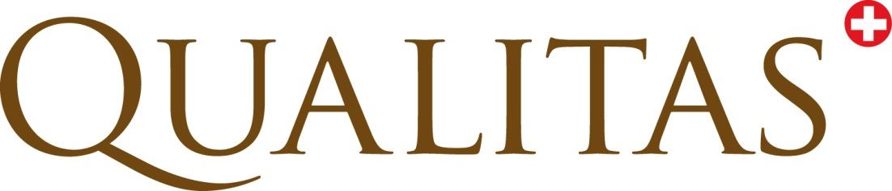

---
output:
  pdf_document:
    includes:
      in_header: tex/header.tex
    fig_caption: false
  word_document: default
---

```{r DocumentSetup, echo=FALSE, results='hide', include=FALSE}
### # specify knitr options
knitr::opts_chunk$set(echo = FALSE, results = 'asis')

### # initialize section counter
robjSecEnum <- rqudocuhelper::SectionEnumerator$new()
```



\fcolorbox{black}{white}{
	\parbox[t]{1.0\linewidth}{
		\centering \fontsize{12pt}{20pt}\selectfont % 
		\vspace*{0.5cm} % 

		\hfill Zusammenfassung / Übersicht

		\vspace*{0.5cm} 
	}
}

\vspace*{0.5cm}

\fcolorbox{black}{white}{
	\parbox[t]{1.0\linewidth}{
		\centering \fontsize{25pt}{40pt}\selectfont %
		\vspace*{0.7cm}
    Übersicht der Daten    \\
    von Lely    \\
    ATDA-ASR    \\

		\vspace*{0.7cm} % Space between the end of the title and the bottom of the grey box
	}
}

\vspace*{1cm}

\begin{center}
\includegraphics[width=0.5\textwidth]{png/Pedigree.png}
\end{center}

\vspace{5ex}
{\centering \small
\hfill
\begin{tabular}{l}
Peter von Rohr                      \\
FB EDV, Qualitas AG                 \\
Chamerstrasse 56, CH-6300 Zug       \\
\verb+http://www.qualitasag.ch+     \\
\verb+peter.vonrohr@qualitasag.ch+  
\end{tabular}
}

\pagebreak

\tableofcontents

\pagebreak

```{r Setup, echo=FALSE}
knitr::opts_chunk$set(echo = FALSE, results = 'asis')
```


```{r DocuStatusTable}
r6objDocStat <- rqudocuhelper::R6ClassDocuStatus$new()
r6objDocStat$setProject(psProject = "ATDA-ASR")
r6objDocStat$setVersion(psVersion = "0.0.901")
r6objDocStat$setStatus(psStatus = "Erstellung")

r6objDocStat$include_doc_stat()
```

\pagebreak

# Abkürzungen

```{r AbrTable}
robjAbrTable <- rqudocuhelper::refObjTable$new()
pvecTableHeader <- c("Abkürzung",
                     "Bedeutung")
robjAbrTable$setTableHeader(psTableHeader = pvecTableHeader)
robjAbrTable$addRow(plTableRow = list(Abr = "ATDA-ASR",
                                      What = "ASR Projekt zum Automatisierten Datentransfer"))
robjAbrTable$addRow(plTableRow = list(Abr = "ISM",
                                      What = "Informationssystem der Melkanlage"))
robjAbrTable$addRow(plTableRow = list(Abr = "API",
                                      What = "Application Programming Interface"))
#robjAbrTable$addRow(plTableRow = list(Abr = "",
#                                      What = ""))
robjAbrTable$to_pander_pandoc(psStyle = "grid",
                              psJustify = rep("left", length(pvecTableHeader)),
                              pnSplitCells = c(20,60))
```

\pagebreak


# Erklärung
Dieses Dokument gibt eine Übersicht der Daten, welche im Projekt `ATDA-ASR` vom ISM einer Anlage von Lely zur zentralen Datenbank übertragen werden können. 


# Einführung
Bei Lely werden die Daten über die Beschreibung eines APIs zur Verfügung gestellt. Technisch gesehen  entspricht die Beschreibung eines APIs einer Beschreibung von Programmfunktionen oder Methoden, welche dem Benutzer des APIs zur Verfügung gestellt werden. Zur Beschreibung gehören die Signatur der Funktion oder der Methode und die Dokumentation der Methode. Aufgrund dieser Information können die Benutzer die Funktionen oder Methoden im API aufrufen.


# API_V22
Die im API zur Verfügung gestellten Daten sind hierarchisch eingeteilt in Module, Objekte und Felder. Die folgende Tabelle gibt eine Übersicht über die Datenorganisation. Jedem Objekt ist auch eine Liste von Methoden zugeordnet, welche dem Benutzer zur Verfügung stehen, um auf die Daten zuzugreifen.

```{r APIV22Table}
dfApiV22 <- data.frame(Objekt = c("Security"),
                       Modul  = c("Basic"),
                       Bedeutung = c("Zugangsdaten"),
                       Datentransfer = c(""))
knitr::kable(dfApiV22)
```


